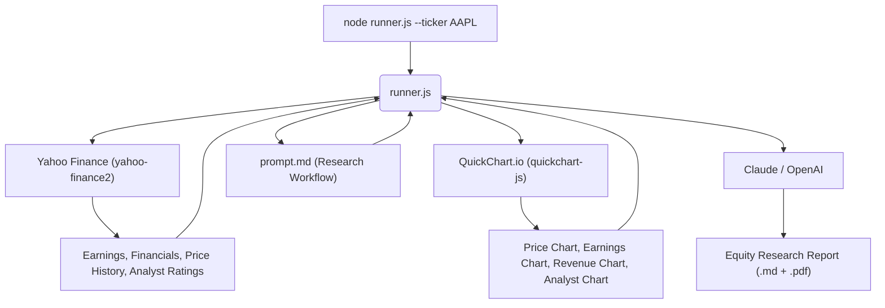

# From Vibe Coding to Vibe Trading: An AI-Powered Equity Research Agent

> Transform your AI agent from a general "vibe coding" tool into a sophisticated "vibe trading" analyst with real-time market data and professional charts.

This project uses a Node.js runner with **Claude** (default) or OpenAI to generate comprehensive equity research reports. Financial data comes from **Yahoo Finance** (free, no API key) and charts are rendered via **QuickChart.io** (free, no API key).

## Quick Start

```bash
# 1. Install dependencies
npm install

# 2. Set up your API keys
cp .env.example .env
# Edit .env and add your ANTHROPIC_API_KEY (and optionally OPENAI_API_KEY)

# 3. Run a report
node runner.js --ticker AAPL
```

Your report will be saved to `reports/AAPL_Report_<date>.md` with embedded charts.

## Usage

```bash
# Generate a report (uses Claude by default)
node runner.js --ticker AAPL

# Specify output path
node runner.js --ticker NVDA --out reports/NVDA_Report.md

# Export as PDF too
node runner.js --ticker TSLA --out reports/TSLA_Report.md --pdf

# Use OpenAI instead of Claude
node runner.js --ticker MSFT --provider openai
```

### CLI Options

| Flag | Description | Default |
|------|-------------|---------|
| `--ticker SYMBOL` | Stock ticker to analyze | *(required)* |
| `--out PATH` | Output file path | `reports/<TICKER>_Report_<date>.md` |
| `--pdf` | Also export as PDF | off |
| `--provider NAME` | `claude` or `openai` | `claude` |

### Environment Variables

| Variable | Description | Default |
|----------|-------------|---------|
| `ANTHROPIC_API_KEY` | Anthropic API key (required for Claude) | - |
| `ANTHROPIC_MODEL` | Claude model override | `claude-sonnet-4-20250514` |
| `OPENAI_API_KEY` | OpenAI API key (required for OpenAI provider) | - |
| `OPENAI_MODEL` | OpenAI model override | `gpt-4o-mini` |
| `PROVIDER` | Default provider | `claude` |

## Architecture



### Data Sources

| Source | What It Provides | API Key? |
|--------|-----------------|----------|
| **Yahoo Finance** | Earnings (actual vs estimate), income statements, balance sheets, price history, analyst ratings, company profile | No |
| **QuickChart.io** | Professional Chart.js charts rendered as image URLs (price line, earnings bar, revenue bar, analyst horizontal bar) | No |

### Generated Charts

Each report includes 4 embedded charts:
1. **1-Year Price History** — Line chart with weekly close prices
2. **Earnings (Actual vs Estimate)** — Grouped bar chart comparing EPS
3. **Revenue & Net Income** — Quarterly bar chart in billions
4. **Analyst Recommendations** — Horizontal bar (Strong Buy → Strong Sell)

## Project Structure

```
vibe-trading/
  runner.js           # Main runner (data + charts + AI + PDF)
  prompt.md           # AI equity research prompt
  .env                # API keys (not committed)
  .env.example        # API key template
  package.json        # Node.js dependencies
  reports/            # Generated reports (.md + .pdf)
  LICENSE
```

## License

MIT
